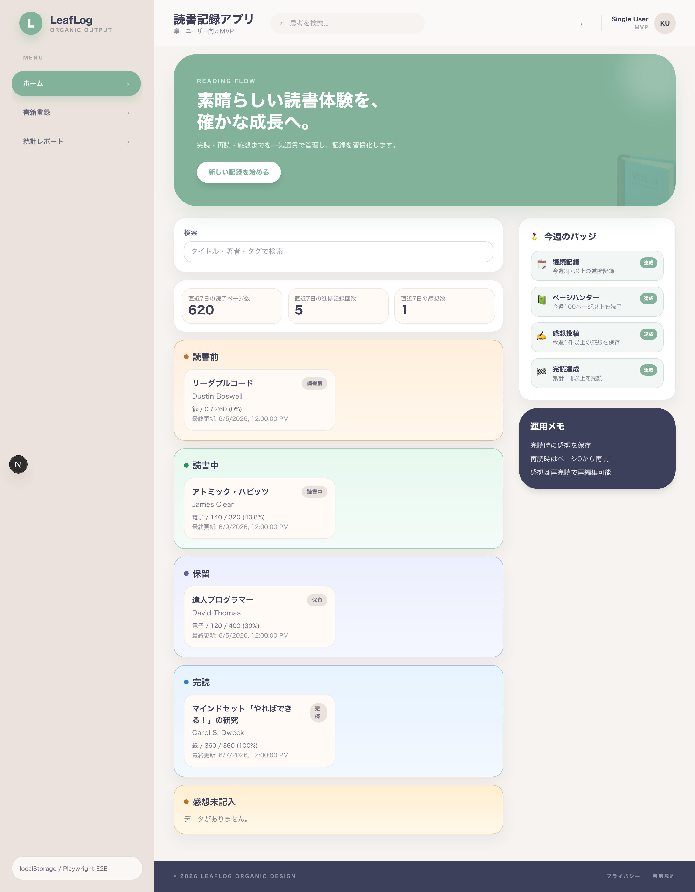
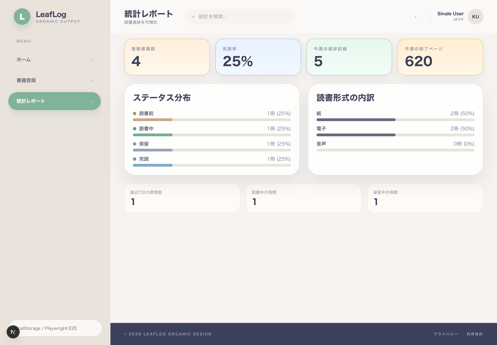
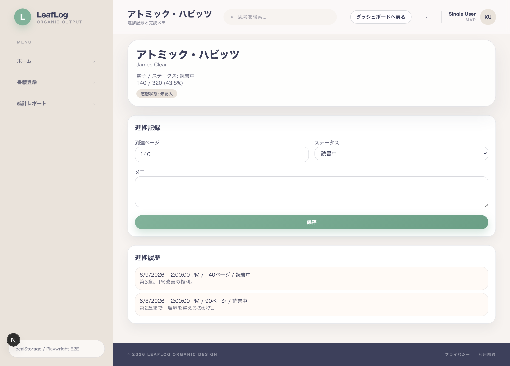
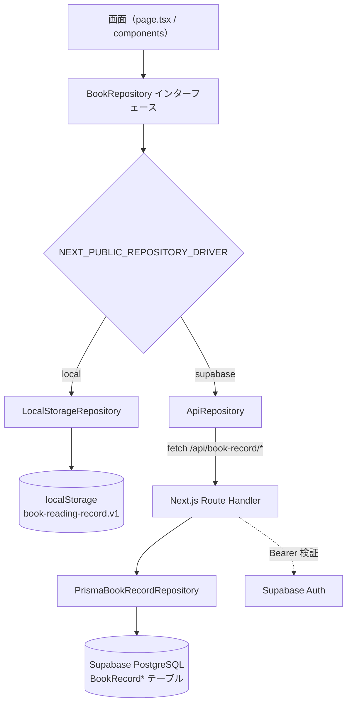

# Book Reading Record Web App

[](https://github.com/kojikawazu/book-reading-record-web-app/actions/workflows/ci.yml)


読書記録（ページ進捗・完読感想・再読）を管理する単一ユーザー向け MVP。

## Screenshots

| ダッシュボード | 統計レポート | 書籍詳細・進捗 |
|:---:|:---:|:---:|
|  |  |  |

> 画像は `docs/assets/` に配置しています。再生成は [docs/assets/README.md](docs/assets/README.md) を参照（`pnpm screenshots`）。

## Features

- 📚 **書籍登録** — タイトル / 著者 / 形式（紙・電子・音声） / 総ページ / 初期ステータス
- 📖 **進捗記録** — 現在ページを絶対値で更新＋メモ＋ステータス変更、履歴表示
- ✅ **完読時感想** — 学び / 行動 / 一文（空入力可。すべて空なら「感想未記入」扱い）
- 🔁 **再読** — 完読 → 読書中へ戻す（`currentPage=0`・感想は保持）
- 🗂️ **ダッシュボード** — 読書前 / 読書中 / 保留 / 完読 / 感想未記入の一覧＋今週のバッジ
- 🔎 **検索** — タイトル・著者・タグの部分一致
- 📅 **週次サマリー** — 直近7日（当日含む）の読了ページ数・進捗回数・感想数
- 📊 **統計レポート**（`/stats`） — 登録数・完読率・ステータス分布・読書形式分布
- 🔐 **認証**（`supabase` モード） — Supabase Auth / Google OAuth。閲覧（`/`・`/stats`）は未ログイン可、更新系はログイン必須

## Tech Stack

| 領域 | 技術 |
|---|---|
| フレームワーク | Next.js 16（App Router） / React 19 |
| 言語 | TypeScript 5 |
| スタイル | Tailwind CSS 4 |
| データ | Supabase PostgreSQL + Prisma 6 / ブラウザ localStorage |
| 認証 | Supabase Auth（Google OAuth） |
| E2E テスト | Playwright（Chromium） |
| パッケージ管理 | pnpm 10 |
| デプロイ | Vercel |

要件: **Node.js 20+ / pnpm 10+**

## Repository Structure

- `front/`: 実装本体（Next.js アプリ）。開発はここで行う
- `docs/`: 仕様書（番号付き 01〜11）。入口は [docs/README.md](docs/README.md)
- `base/`: 参照用の既存 MVP（**read-only** — 設計の土台にした参照実装。編集しない）

## Quickstart（Supabase 不要・最短）

`local` モードは localStorage だけで完結するため、**設定なしですぐ動きます**。

```bash
cd front
pnpm install
NEXT_PUBLIC_REPOSITORY_DRIVER=local pnpm dev
```

→ ブラウザで http://localhost:3000

> 環境変数が未設定でも自動的に `local` モードで起動します（`front/src/lib/repository-instance.ts`）。まず触ってみるならこの方法が確実です。

## データ保存モード

| モード | 保存先 | 用途 | 必要な設定 |
|---|---|---|---|
| `local` | ブラウザ localStorage | お試し・E2E 受け入れ | なし |
| `supabase` | Supabase PostgreSQL（Prisma） | 通常運用 | 実 Supabase URL / キー |

`NEXT_PUBLIC_REPOSITORY_DRIVER` で切り替えます。
⚠️ **`supabase` を使う場合は実際の資格情報が必須**です。`.env.example` をコピーしただけ（プレースホルダのまま）では認証エラーになり更新操作ができません。手順は [front/README.md](front/README.md) を参照してください。

## Architecture

画面は `BookRepository` インターフェース越しにデータへアクセスし、driver で実装を差し替えます。



詳細は [docs/09-architecture-specification.md](docs/09-architecture-specification.md) を参照。

## Documentation

仕様は `docs/` に番号付きで分割しています（索引: [docs/README.md](docs/README.md)）。

| # | ドキュメント | 内容 |
|---|---|---|
| 01 | [business-requirements](docs/01-business-requirements.md) | 要求仕様（背景・スコープ・制約） |
| 02 | [requirements-specification](docs/02-requirements-specification.md) | 要件仕様（機能要件・優先度） |
| 03 | [functional-specification](docs/03-functional-specification.md) | 機能仕様（UI/UX・業務ルール） |
| 04 | [non-functional-specification](docs/04-non-functional-specification.md) | 非機能仕様 |
| 05 | [data-specification](docs/05-data-specification.md) | データ仕様（モデル・ER 図） |
| 06 | [security-specification](docs/06-security-specification.md) | セキュリティ（認証・RLS・検証） |
| 07 | [api-specification](docs/07-api-specification.md) | API / Repository 仕様 |
| 08 | [test-specification](docs/08-test-specification.md) | テスト仕様（受け入れ E2E 含む） |
| 09 | [architecture-specification](docs/09-architecture-specification.md) | アーキテクチャ仕様 |
| 10 | [miscellaneous-specification](docs/10-miscellaneous-specification.md) | その他（用語集・参照） |
| 11 | [tasks](docs/11-tasks.md) | タスク・体制・進行フロー |

優先順位（矛盾時）: `docs/08-test-specification.md`（受け入れ E2E）> `docs/02-requirements-specification.md` > `docs/03-functional-specification.md`

## Development

```bash
cd front
pnpm format:check   # Prettier（整形チェック）
pnpm lint           # ESLint
pnpm build          # 本番ビルド（内部で prisma generate を実行）
pnpm test:e2e       # Playwright E2E（local モードで起動）
```

> `pnpm build` / `pnpm test:e2e:install` の詳細・E2E のUIモード等は [front/README.md](front/README.md) を参照。
> 開発フロー（ブランチ運用・テスト必須・PR ルール）は [.claude/rules/](.claude/rules/) にまとまっています。

## Deploy

- 本番は **Vercel**。
- `front/vercel.json` の `ignoreCommand` により、`docs/` のみ変更のコミットは Vercel ビルドをスキップ。
- CI（`.github/workflows/ci.yml`）は `docs/**` のみの変更時に E2E をスキップ。
