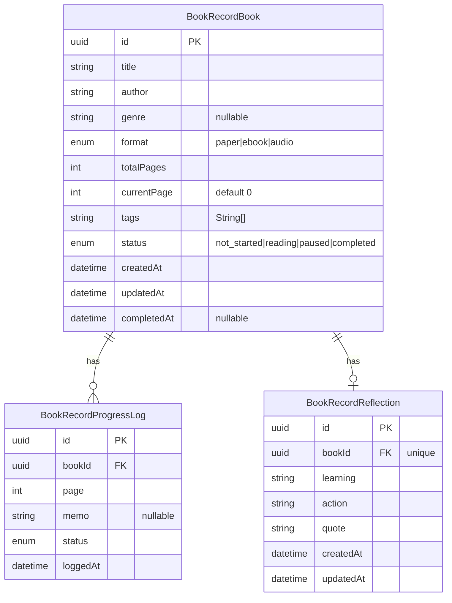

# データ仕様書（Data Specification）

読書記録アプリのデータ構造と永続化仕様（`supabase` / `local`）を定義する。

## 目次

- [1. 目的](#1-目的)
- [2. データモデル](#2-データモデル)
  - [2.1 Book](#21-book)
  - [2.2 ProgressLog](#22-progresslog)
  - [2.3 Reflection](#23-reflection)
  - [2.4 StoragePayload（`local` モード専用）](#24-storagepayloadlocal-モード専用)
  - [2.5 ER 図（論理モデル）](#25-er-図論理モデル)
- [3. データ使用方針](#3-データ使用方針)
- [4. 永続化モード](#4-永続化モード)
  - [4.1 `supabase` モード（通常運用）](#41-supabase-モード通常運用)
  - [4.2 `local` モード（E2E / ローカル受け入れ）](#42-local-モードe2e--ローカル受け入れ)
- [5. データ破損と復旧（`local` モード）](#5-データ破損と復旧local-モード)
- [6. バージョン移行（`local` モード）](#6-バージョン移行local-モード)
- [7. DBスキーマ（`supabase` モード）](#7-dbスキーマsupabase-モード)
- [8. 拡張方針](#8-拡張方針)

## 1. 目的
- 読書記録アプリのデータ構造と永続化仕様（`supabase` / `local`）を定義する

## 2. データモデル

### 2.1 Book
- `id: string`
- `title: string`
- `author: string`
- `genre?: string`
- `format: "paper" | "ebook" | "audio"`
- `totalPages: number`
- `currentPage: number`
- `tags: string[]`
- `status: "not_started" | "reading" | "paused" | "completed"`
- `createdAt: string` (ISO 8601)
- `updatedAt: string` (ISO 8601)
- `completedAt?: string` (ISO 8601)
- `reflection?: Reflection`

- 備考
  - 書籍登録直後の `currentPage` は `0` で初期化する
  - ユーザーIDやプロフィール情報はMVPでは保持しない

### 2.2 ProgressLog
- `id: string`
- `bookId: string`
- `page: number`
- `memo?: string`
- `status: "not_started" | "reading" | "paused" | "completed"`
- `loggedAt: string` (ISO 8601)

### 2.3 Reflection
- `learning: string`
- `action: string`
- `quote: string`
- `createdAt: string` (ISO 8601)

### 2.4 StoragePayload（`local` モード専用）
- `version: number`
- `books: Book[]`
- `progressLogs: ProgressLog[]`

### 2.5 ER 図（論理モデル）

- `local` モードでは上記を `Book` / `ProgressLog` / `Reflection`（`reflection` は `Book` に埋め込み）として保持する。
- `supabase` モードの物理テーブルは §7 を参照。

## 3. データ使用方針
- 扱うデータ: 書籍情報、進捗記録、感想
- 画面は `BookRepository` を通じてデータへアクセスする
- `NEXT_PUBLIC_REPOSITORY_DRIVER=supabase` の場合は `/api/book-record/*` 経由で Supabase DB を利用する
- `NEXT_PUBLIC_REPOSITORY_DRIVER=local` の場合はブラウザ `localStorage` を利用する

## 4. 永続化モード
### 4.1 `supabase` モード（通常運用）
- 保存先: Supabase PostgreSQL（`BookRecord*` テーブル）
- 参照実装:
  - `ApiRepository`（クライアント）
  - Next.js Route Handler（`/api/book-record/*`）
  - `PrismaBookRecordRepository`（サーバー）
- 認可:
  - 閲覧系GETは未認証でも利用可能
  - 更新系はBearerトークン必須

### 4.2 `local` モード（E2E / ローカル受け入れ）
- 保存先: `localStorage`
- 保存キー: `book-reading-record.v1`
- 初期値:
  - `{ "version": 1, "books": [], "progressLogs": [] }`
- データ初期化:
  - キー未設定時は初期値で開始する
- 保持期間:
  - ユーザーが削除するまで無期限

## 5. データ破損と復旧（`local` モード）
- JSON parse失敗時は破損データとして扱う
- 破損データは `book-reading-record.v1.bak.<timestamp>` に退避する
- 退避後、初期値で再初期化して起動する
- UIに「復旧メッセージ」を表示する

## 6. バージョン移行（`local` モード）
- `StoragePayload.version` でスキーマ判定する
- 自動移行不可の場合:
  - バックアップ退避
  - 初期値で再初期化

## 7. DBスキーマ（`supabase` モード）
- Prisma スキーマ定義は `front/prisma/schema.prisma` を正とする。
- 物理テーブル名は `BookRecord` 接頭辞を付与する。
  - `BookRecordBooks`（model `BookRecordBook`）
  - `BookRecordProgressLogs`（model `BookRecordProgressLog`）
  - `BookRecordReflections`（model `BookRecordReflection`）
- スキーマ同期フロー（`db pull` 運用）は `docs/09-architecture-specification.md` を参照する。

## 8. 拡張方針
- `supabase` / `local` のどちらでも `Book` / `ProgressLog` / `Reflection` の論理モデルは維持する
- 既存ローカルデータのインポートは別タスクで設計する
