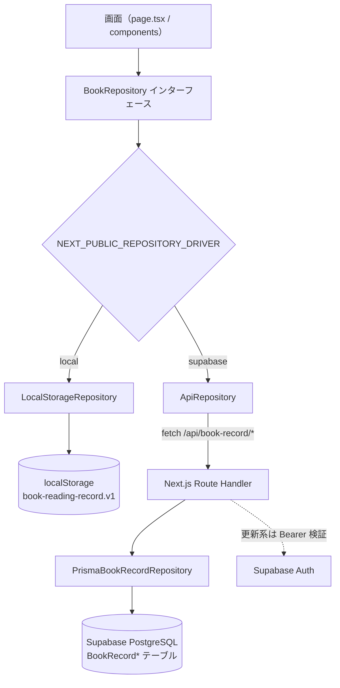

# アーキテクチャ仕様書（Architecture Specification）

システム構成・技術スタック・データアクセス層・環境変数・スキーマ同期フロー・デプロイを定義する。

## 1. リポジトリ構成
- `base/`: 参照用の既存MVP（**read-only**）
- `front/`: 実装本体（Next.js / TypeScript / Tailwind CSS）
- `docs/`: 要件・仕様・E2Eケース

## 2. 技術スタック
- フロントエンド: Next.js / TypeScript / Tailwind CSS
- 認証: Supabase Auth（Google OAuth）
- データ永続化: Supabase PostgreSQL（Prisma）/ localStorage
- E2E テスト: Playwright（Chromium）
- デプロイ先: Vercel

## 3. データアクセスアーキテクチャ
- 画面はRepositoryインターフェース経由でデータ操作する（`docs/07-api-specification.md` §2）
- ドライバーは `NEXT_PUBLIC_REPOSITORY_DRIVER` で切り替える（`supabase` / `local`）
- `local` モードでは `LocalStorageRepository` を利用する
- `supabase` モードでは `ApiRepository` を利用し、`/api/book-record/*` にアクセスする
- API Route Handler は `PrismaBookRecordRepository` に委譲して Supabase DB を操作する

### 3.1 `supabase` モード方針
- ユーザープロフィール機能が必要になるまでは単一ユーザー構成を維持する
- 実装方針（2026-02-07）
  - クライアントは `ApiRepository` を利用する
  - データ更新は Next.js Route Handler 経由で `PrismaBookRecordRepository` に委譲する
  - 運用時の切り替えは `NEXT_PUBLIC_REPOSITORY_DRIVER` で行う（`supabase` / `local`）

## 4. 環境変数
- 設定ファイルは `front/.env.local` を利用する
- 共有テンプレートは `front/.env.example` に保持する
- 想定キー
  - `NEXT_PUBLIC_SUPABASE_URL`
  - `NEXT_PUBLIC_SUPABASE_ANON_KEY`
  - `NEXT_PUBLIC_SUPABASE_PUBLISHABLE_KEY`（任意、利用時のみ）
  - `NEXT_PUBLIC_REPOSITORY_DRIVER`（`supabase` / `local`）
  - `DATABASE_URL`
  - `DIRECT_URL`
  - `SUPABASE_SERVICE_ROLE_KEY`（サーバー用途のみ）
- `GOOGLE_CLIENT_ID` / `GOOGLE_CLIENT_SECRET` はこのリポジトリの `.env.local` では管理しない（Supabase Auth プロジェクト側で管理）

## 5. Supabase + Prisma スキーマ同期フロー（チーム連携）
- 前提
  - Supabase DB / Auth は既存プロジェクトを利用する
- このリポジトリ側の実施内容
  - Prismaで既存プロジェクトのテーブル定義を `db pull` して同期する
  - 実行コマンドは `cd front && pnpm prisma:pull`
  - pull前後で `pnpm prisma:validate` / `pnpm prisma:generate` を実行する
  - 今回プロジェクトの物理テーブル名は `BookRecord` 接頭辞を付与する
    - `BookRecordBooks`
    - `BookRecordProgressLogs`
    - `BookRecordReflections`
  - 必要な仮修正を行い、差分を別プロジェクトに依頼する
- 別プロジェクト側の実施内容
  - Prisma `push` で本番相当のテーブル定義へ反映する
- 反映後の手順
  - このリポジトリで再度 `db pull` を行い、最新定義に同期する
- 禁止事項（このリポジトリ）
  - `db push` / `migrate` の直接実行

## 6. デプロイ / CI
- デプロイ先は Vercel。
- `front/vercel.json` の `ignoreCommand`（`scripts/vercel-ignore-docs.sh`）で、`docs/` のみ変更されたコミットは Vercel ビルドをスキップする。`front/` 配下やその他ファイルの変更がある場合は通常どおりビルドする。
- GitHub Actions（`.github/workflows/ci.yml`）は `docs/**` のみの変更時に CI をスキップする。
