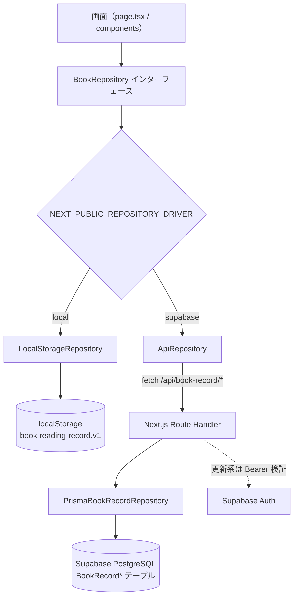

# アーキテクチャ仕様書（Architecture Specification）

システム構成・技術スタック・データアクセス層・環境変数・スキーマ同期フロー・デプロイを定義する。

## 目次

- [1. リポジトリ構成](#1-リポジトリ構成)
- [2. 技術スタック](#2-技術スタック)
- [3. データアクセスアーキテクチャ](#3-データアクセスアーキテクチャ)
  - [3.1 `supabase` モード方針](#31-supabase-モード方針)
- [4. 環境変数](#4-環境変数)
- [5. Supabase + Prisma スキーマ同期フロー（チーム連携）](#5-supabase--prisma-スキーマ同期フローチーム連携)
- [6. デプロイ / CI](#6-デプロイ--ci)

## 1. リポジトリ構成

- `base/`: 参照用の既存MVP（**read-only**）
- `front/`: 実装本体（Next.js / TypeScript / Tailwind CSS）
- `docs/`: 要件・仕様・E2Eケース

## 2. 技術スタック

- フロントエンド: Next.js / TypeScript / Tailwind CSS
- 認証: Supabase Auth（Google OAuth）
- データ永続化: Supabase PostgreSQL（Prisma）/ localStorage
- E2E テスト: Playwright（Chromium）
- デプロイ先: Vercel

## 3. データアクセスアーキテクチャ

- 画面はRepositoryインターフェース経由でデータ操作する（`docs/07-api-specification.md` §2）
- ドライバーは `NEXT_PUBLIC_REPOSITORY_DRIVER` で切り替える（`supabase` / `local`）
- `local` モードでは `LocalStorageRepository` を利用する
- `supabase` モードでは `ApiRepository` を利用し、`/api/book-record/*` にアクセスする
- API Route Handler は `PrismaBookRecordRepository` に委譲して Supabase DB を操作する

```mermaid
flowchart TD
    UI["画面（page.tsx / components）"] --> REPO["BookRepository インターフェース"]
    REPO --> DRV{"NEXT_PUBLIC_REPOSITORY_DRIVER"}
    DRV -->|local| LSR["LocalStorageRepository"]
    LSR --> LS[("localStorage<br/>book-reading-record.v1")]
    DRV -->|supabase| API["ApiRepository"]
    API -->|"fetch /api/book-record/*"| RH["Next.js Route Handler"]
    RH --> PRP["PrismaBookRecordRepository"]
    PRP --> DB[("Supabase PostgreSQL<br/>BookRecord* テーブル")]
    RH -. "更新系は Bearer 検証" .-> AUTH["Supabase Auth"]
```

### 3.1 `supabase` モード方針

- ユーザープロフィール機能が必要になるまでは単一ユーザー構成を維持する
- 実装方針（2026-02-07）
  - クライアントは `ApiRepository` を利用する
  - データ更新は Next.js Route Handler 経由で `PrismaBookRecordRepository` に委譲する
  - 運用時の切り替えは `NEXT_PUBLIC_REPOSITORY_DRIVER` で行う（`supabase` / `local`）

## 4. 環境変数

- 設定ファイルは `front/.env.local` を利用する
- 共有テンプレートは `front/.env.example` に保持する
- 想定キー
  - `NEXT_PUBLIC_SUPABASE_URL`
  - `NEXT_PUBLIC_SUPABASE_ANON_KEY`
  - `NEXT_PUBLIC_SUPABASE_PUBLISHABLE_KEY`（任意、利用時のみ）
  - `NEXT_PUBLIC_REPOSITORY_DRIVER`（`supabase` / `local`）
  - `DATABASE_URL`（**本番・開発の接続先。テストからは参照しない**）
  - `DIRECT_URL`
  - `SUPABASE_SERVICE_ROLE_KEY`（サーバー用途のみ）
- テスト用の接続先は `front/.env.test`（gitignore 対象）または環境変数で指定する。`.env.local` には置かない
  - `TEST_DATABASE_URL`（IT / E2E 専用。未設定なら `docker-compose.test.yml` の使い捨てコンテナが既定値。ホストは `localhost` / `127.0.0.1` / `::1` のみ許可）
- `GOOGLE_CLIENT_ID` / `GOOGLE_CLIENT_SECRET` はこのリポジトリの `.env.local` では管理しない（Supabase Auth プロジェクト側で管理）

## 5. Supabase + Prisma スキーマ同期フロー（チーム連携）

- 前提
  - Supabase DB / Auth は既存プロジェクトを利用する
- このリポジトリ側の実施内容
  - Prismaで既存プロジェクトのテーブル定義を `db pull` して同期する
  - 実行コマンドは `cd front && pnpm prisma:pull`
  - `scripts/prisma-with-env-local.mjs` は `.env.local`（本番接続情報）を注入して Prisma を起動するため、**破壊的サブコマンド（`migrate` / `db push` / `db execute` / `db seed`）を実行前に拒否する**（`.claude/rules/database.md` / `.claude/rules/production-data.md` をコードで担保する）
  - pull前後で `pnpm prisma:validate` / `pnpm prisma:generate` を実行する
  - 今回プロジェクトの物理テーブル名は `BookRecord` 接頭辞を付与する
    - `BookRecordBooks`
    - `BookRecordProgressLogs`
    - `BookRecordReflections`
  - 必要な仮修正を行い、差分を別プロジェクトに依頼する
- 別プロジェクト側の実施内容
  - Prisma `push` で本番相当のテーブル定義へ反映する
- 反映後の手順
  - このリポジトリで再度 `db pull` を行い、最新定義に同期する
- 禁止事項（このリポジトリ）
  - 共有 Supabase プロジェクトへの `db push` / `migrate` の直接実行
  - 例外: IT / E2E のテスト用**使い捨て Postgres コンテナ**への `db push` は許可（共有 DB には接続しない。`docs/08-test-specification.md`・`.claude/rules/database.md`）

## 6. デプロイ / CI

- デプロイ先は Vercel。
- `front/vercel.json` の `git.deploymentEnabled` でデプロイ対象ブランチを制御する（`"**": false` + `"main": true`）。`main` 以外のブランチでは Preview を発火させない。
- **ビルドスキップ（`ignoreCommand`）は使わない。** 判定を誤ると「デプロイ履歴は緑のまま本番が古い」状態が潜伏するため（`.claude/rules/vercel.md` §2）。パスによる実行制御は本番状態を壊さない CI 側へ寄せる。
- GitHub Actions（`.github/workflows/ci.yml`）は `docs/**` / `*.md` のみの変更時に CI をスキップする。
- CI は4ジョブ構成（並列実行）:
  - `static` — `format:check` / `lint` / `tsc --noEmit`（静的ゲート・最速の門番）
  - `ut` — `pnpm test`（UT・jsdom・DB 不要）
  - `it` — `pnpm test:it`（IT・`docker-compose.test.yml` の使い捨て Postgres で実行。共有 DB 非接続）
  - `e2e` — `pnpm test:e2e`（Playwright / Chromium・local レーン・受け入れ Case 1-18）
